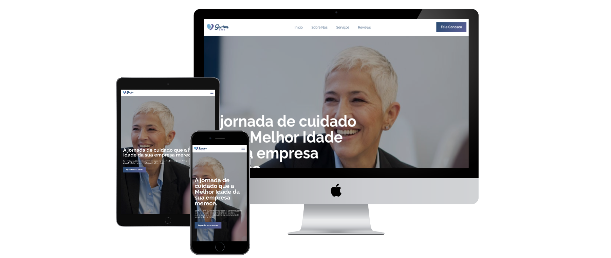

# SeniorCare 👴🧓



<p align="center">
  
  
  
</p>

🇧🇷 Você não fala inglês? [Clique aqui](README.pt.md) para ler a versão em português.

## 🚀 About the Project

Welcome to the **SeniorCare** repository, our innovative solution for the Global Solution 2023.2 challenge, a partnership between FIAP and Hapvida.

Our goal is to use technology to create a healthier future. To achieve this, we developed a web application, using HTML, CSS, JavaScript and the Swiper framework.

SeniorCare is not only a showcase for our revolutionary proposition, but also an essential contribution to the discipline of Responsive Web.

We invite you to explore our project and join us on the journey to a healthier tomorrow.

## 🛠️ Technologies Used

- HTML
- CSS
- JavaScript
  - Swiper JS

## ⚙️ Installation and Use

To install and use this project, follow these steps:

1. Clone this repository on your local machine
```bash
git clone https://github.com/artur-duart/seniorcare
```
2. Navigate to the main folder of the project
```bash
cd seniorcare
```
3. Open the `index.html` file in your browser

Now you can access the project in your browser.

## 🤝 Contributing

Contributions are always welcome! If you have any suggestions or corrections, feel free to open an issue or submit a pull request.

## 📝 License

This project is licensed under the MIT License. See the [LICENSE](LICENSE) file for more details.

---

Made with 💜 by <a href="https://www.linkedin.com/in/artur-duart/">Artur Duarte</a> :wave:
